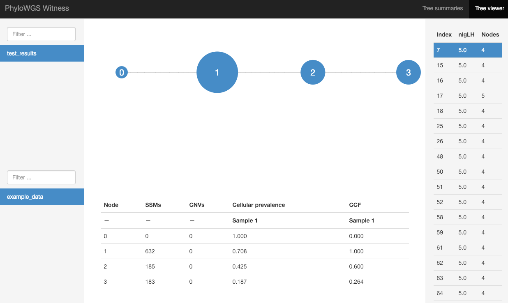
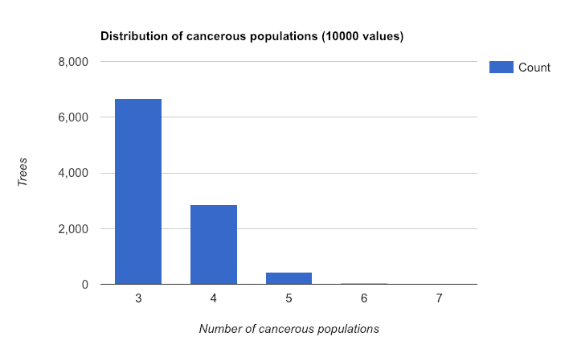

```{r setup, include=FALSE}
knitr::opts_chunk$set(echo = TRUE)
```

This R markdown file illustrate the usage of R package ```basic``` using simulated data, as described in our paper: Sun et al. (2019) Joint Analysis of Single Cell and Bulk Tissue Sequencing Data to Infer Intra-Tumor Heterogeneity. Here we evaluate two alternative methods: B-SCITE and PhyloWGS. 

```{r libraries, warning = FALSE, message = FALSE}
library(basic)
library(ggcorrplot)
library(gridExtra)
library(knitr)
```

## B-SCITE

### Prepare input for B-SCITE

We first loaded the simulated data and prepare input for B-SCITE. Because B-SCITE does not take into account of copy number information, we only evaluate it using the data without copy number alterations. The input scDNA-seq data is saved in a text file as a binary matrix with each row being a mutation and each column being a cell.

```{r prepare_sc_data}
load("basic/data/simulation_SCS_bulk.RData")

mutations = simu.SCS$observed.mutation
dim(mutations)
mutations[1:2,1:3]
table(c(mutations), useNA="ifany")

mutations[which(is.na(mutations))] = 3
table(c(mutations), useNA="ifany")

write.table(mutations, file = "basic/data/B-SCITE_SCFile_n_1000_m_20.txt", 
            append = FALSE, quote = FALSE, sep = "\t", 
            row.names = FALSE, col.names = FALSE)
```

The input bulk tumor data is saved in a text file with each row being one mutation. 

```{r prepare_bulk_data}
b.trec  = simu.bulk$trec
b.asrec = simu.bulk$asrec
n = length(b.trec)

bulk = data.frame(ID=paste0("mut", 1:n), Chromosome=rep(1,n), Position=1:n)
bulk$MutantCount = b.asrec
bulk$ReferenceCount = b.trec - b.asrec
bulk$INFO = paste0("ID=mut", 1:n, ";")

dim(bulk)
bulk[1:2,]

write.table(bulk, file = "basic/data/B-SCITE_bulkFile_n_1000.txt", 
            append = FALSE, quote = FALSE, sep = "\t", 
            row.names = FALSE, col.names = TRUE)
```

B-SCITE is designed for more detailed studies of a small number of mutations because it searches all the possible mutation trees and the number of mutation trees increases super-exponentially with the number of mutations. Therefore analyzing 1000 mutations is computational challenging of B-SCITE. In our experience, running B-SCITE for 1000 mutations will take more than 3 days and the results can be unstable across runs.  So we generate a smaller dataset by randomly sample 100 mutations. 

```{r prepare_sc_data2}
set.seed(2020)
s100 = sort(sample(nrow(mutations), 100))

write.table(mutations[s100,], file = "basic/data/B-SCITE_SCFile_n_100_m_20.txt", 
            append = FALSE, quote = FALSE, sep = "\t", 
            row.names = FALSE, col.names = FALSE)

write.table(bulk[s100,], file = "basic/data/B-SCITE_bulkFile_n_100.txt", 
            append = FALSE, quote = FALSE, sep = "\t", 
            row.names = FALSE, col.names = TRUE)
```

### Run BaSiC

We first run BaSiC on this sub-sampled dataset

```{r analysis_basic}
b.trec    = simu.bulk$trec[s100]
b.asrec   = simu.bulk$asrec[s100]
b.cn      = rep(2, length(b.trec))

mutations = simu.SCS$observed.mutation[s100,]
trec      = simu.SCS$trec[s100,]
asrec     = simu.SCS$asrec[s100,]

cBSC = cluster.BSC(b.cn, b.asrec, b.trec, mutations, asrec, trec, nclusters=2:5)
cBSC$summary.cluster
```

To summarize the results from BaSiC, we first generate the true cluster membership: the first 600 mutations belong to cluster 1, 601-800 for cluster 2, 801-900 for cluster 3, and 901-1000 for cluster 4. Based on AIC, BaSiC chose 5 clusters. They are very well aligned with the 4 true clusters, except that the 1st true cluster is split into two clusters by BaSiC. 
```{r basic_summary}
n1 = sum(s100 <= 600)
n2 = sum(s100 <= 800) - n1
n3 = sum(s100 <= 900) - n1 - n2
n4 = length(s100) - n1 - n2 - n3
c(n1, n2, n3, n4)

mut.cluster.true  = c(rep(1,n1), rep(2,n2), rep(3,n3), rep(4,n4))
mut.cluster.basic = apply(cBSC$n5$postPs, 1, which.max)
table(mut.cluster.true, mut.cluster.basic)
```

The results of BaSiC is more accurate (e.g., identify 4 instead of 5 clusters) when we use all 1000 mutations. See the file ```ex_simulation.html``` for more details. Here we illustrate the mutation data. The observed mutations is indeed very noisy. 

```{r plot3, fig.width=9, fig.height=4.5}
Ds = mutations
Es = simu.SCS$true.mutations[s100,]

par(mfrow=c(1,3), mar=c(4,4,4,1))
image(t(Ds), col=c("grey", "darkred"), axes = FALSE, xlab="Cells", 
      ylab="Mutations", main="observed mutations")
image(t(Es), col=c("grey", "darkred"), axes = FALSE, xlab="Cells", 
      ylab="Mutations", main="true mutations")
image(t(cBSC$n5$E), col=c("grey", "darkred"), axes = FALSE, xlab="Cells", 
      ylab="Mutations", main="esimated mutations")
```

### Run B-SCITE

We downloaded the B-SCITE package from https://github.com/smalikic/B-SCITE. Then we compiled it following the instruction at https://github.com/smalikic/B-SCITE, and ran the analysis using command ```python run_B-SCITE.py```. We modified the code ```run_B-SCITE.py``` for our analysis to update the path for input files. In addition, we changed the line of ```run_command += "-SCFileLocation "   + SCFile   + " "``` to be ```run_command += "-i "   + SCFile   + " "```. This is because in the cpp source code, the single cell data file is provided through ```-i```.  Without this update, we encountered an error message ```unknown parameter -SCFileLocation```. 

```{python, eval=FALSE}
import sys
import os

APP_PATH  =  "./../src/bscite.exe" # path to B-SCITE executable
OUTPUT_FOLDER = "./basic_simulation" # this is the prefix used for the three output files (.matrices, .gv and .newick) given as the output of B-SCITE

SCFile   = "./B-SCITE_SCFile_n_100_m_20.txt" # path input SC File
bulkFile = "./B-SCITE_bulkFile_n_100.txt"    # path input bulk file
fp = 0.00001 # estimated false positive rate of SCS experiment
fn = 0.15    # estimated false negative rate of SCS experiment
n  = 100     # number of mutations
m  = 20      # number of cells
r  = 1       # number of repeats
l  = 2000    # number of loops

run_command =""
run_command += APP_PATH + " "
run_command += "-i "   + SCFile   + " "
run_command += "-bulkFileLocation " + bulkFile + " "
run_command += "-n "  + str(n)  + " "
run_command += "-m "  + str(m)  + " "
run_command += "-fd " + str(fp) + " "
run_command += "-ad " + str(fn) + " "
run_command += "-r "  + str(r)  + " "
run_command += "-l "  + str(l)  + " "
run_command += "-o "  + OUTPUT_FOLDER + " "
os.system(run_command)
```

### Summarize B-SCITE results
Here we summarize the results of B-SCITE by a plot. The correct cluster is 1-61, 62-78, 79-87, and 88-100. It is apparent that B-SCITE does not capture the correct cluster accurately. 
```{r bscite_summarize, warning = FALSE, message = FALSE, fig.height=20, fig.width=8}
cumsum(c(n1, n2, n3, n4))

library(Rgraphviz)
g1 = agread("basic/data/basic_simulation_100_ml0.gv")
cols = rep(c("lightblue", "grey", "lightyellow", "lightgreen"),
           times=c(n1,n2,n3,n4))
names(cols) = 1:100
plot(g1, nodeAttrs=list(fillcolor=cols))
```

## PhyloWGS

To evaluate the results of PhyloWGS, which only use bulk DNA-seq data, we used all 1000 mutations. 
### Prepare input for PhyloWGS
The most important information of somatic mutations (file ```PhyloWGS_ssm_data.txt```) is saved in columns ```a```` (reference read count) and ```d``` (total read count). ```mu_r``` and ```mu_v``` is the fraction of expected reference allele sampling from the reference population and the fraction of expected reference allele sampling from variant population, respectively. Since there is no copy number, we simply create an empty file for copy number data. 

```{r prepare_bulk_data_phyloWGS, fig.height=3, fig.width=4}
bulk2 = data.frame(id=paste0("s", 0:(n-1)), gene=paste0("gene", 0:(n-1)))
bulk2$a = b.trec-b.asrec
bulk2$d = b.trec
bulk2$mu_r = rep(0.999, n)
bulk2$mu_v = rep(0.499, n)

dim(bulk2)
bulk2[1:2,]

par(mar=c(5,4,1,1))
hist(bulk2$a/bulk2$d, xlab="total depth", ylab="reference depth", 
     breaks=20, main="")

write.table(bulk2, file = "basic/data/PhyloWGS_ssm_data.txt", 
            append = FALSE, quote = FALSE, sep = "\t", 
            row.names = FALSE, col.names = TRUE)

if(file.exists("PhyloWGS_cnv_data.txt")){ system("rm PhyloWGS_cnv_data.txt") }
system("touch PhyloWGS_cnv_data.txt")
```

### Run PhyloWGS

We used the following shell script to run PhyloWGS. First copy the files ```PhyloWGS_ssm_data.txt``` and ```PhyloWGS_cnv_data.txt``` to a working directory and run the fillowing shell script in the working directory. 

```{bash, eval=FALSE}

#!/bin/sh

echo 'Run PhyloWGS ...'

python ~/research/ITH/_software/phylowgs/multievolve.py \
--num-chains 4 \
--ssms PhyloWGS_ssm_data.txt \
--cnvs PhyloWGS_cnv_data.txt

cd chains

[ ! -d test_results ] && mkdir test_results
cd test_results

echo 'Summarize PhyloWGS result ...'

python ~/research/ITH/_software/phylowgs/write_results.py \
--include-ssm-names \
--min-ssms 2 \
example_data ../trees.zip \
example_data.summ.json.gz \
example_data.muts.json.gz \
example_data.mutass.zip

cd ..
cp -r test_results ~/research/ITH/_software/phylowgs/witness/data
cd ~/research/ITH/_software/phylowgs/witness
gunzip data/*/*.gz
python index_data.py
python -m SimpleHTTPServer
```
Then the results can be viewed from http://127.0.0.1:8000 in your browser. Here are a few screenshots of the results. The first plot shows the phylogenetic tree. As expected, PhyloWGS identify three subclones and cannot separate the two subclones with very similar cellular frequencies. Here simulated subclone 3 and 4 were combined into subclone 3. 

```{r, out.width = "80%", echo=FALSE}

```

Next plot shows the the number of subclones across all trees sampled by PhyloGWS's MCMC. In most cases, 3 subclones were found.  

```{r, out.width = "70%", echo=FALSE}

```

```{r}
sessionInfo()
```

